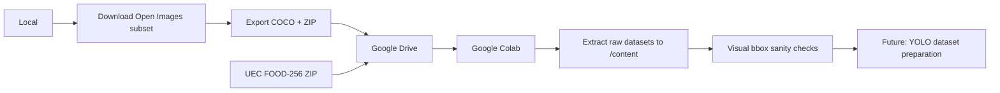

# IAA Table Assistant

Table assistant for visually impaired people, based on object detection with YOLO.

## Description

The goal of this project is to develop a system capable of identifying common objects on a table (food, cutlery, tableware) to assist visually impaired people. The system is built in incremental phases.

## Current status: Phase 1

Phase 1 focuses exclusively on:

- Dataset preparation and validation
- Training a YOLO-based object detection model
- Metric evaluation (mAP, precision, recall)
- Experiment tracking with MLflow
- Data versioning with DVC
- Model export to ONNX format

Phase 1 **does not include** real-time camera, audio synthesis, or interactive prototype.

## Model classes

| ID | Class |
|----|-------|
| 0  | food |
| 1  | cup |
| 2  | bottle |
| 3  | plate |
| 4  | spoon |
| 5  | fork |
| 6  | knife |

## Architecture

The conceptual architecture, component responsibilities and Phase 1 pipeline are documented in:

[Architecture — Phase 1](docs/architecture.md)

## Datasets

- **Open Images V7** — Source dataset for object classes (bottle, cup, plate, bowl, spoon, fork, knife). Exported to COCO Detection format.
- **UEC FOOD-256** — Source dataset for the generic `food` class. All 256 food categories are mapped to a single `food` class.

## Dataset workflow



For detailed environment setup, Google Drive structure, and dataset preparation steps, see:
[Environment and Data Setup](docs/environment-and-data-setup.md)

## Project structure

```
iaa-table-assistant/
├── configs/          # Class, dataset, and hyperparameter configuration
├── notebooks/        # Experimentation notebooks (Colab)
├── src/
│   ├── data/         # Data pipeline: download, prepare, convert, validate
│   ├── training/     # Model training and evaluation
│   ├── inference/    # ONNX export and validation (pending)
│   └── utils/        # Shared utilities
├── datasets/         # Images and labels (not versioned in git)
├── models/           # Trained model weights
├── outputs/          # Training artifacts
├── reports/          # Experiment logs and dataset notes
└── docs/             # Project documentation
```

## Setup

```bash
pip install -r requirements.txt
```

## Current useful commands

Download an Open Images V7 subset locally (requires FiftyOne):

```bash
python -m src.data.download_open_images_subset
```

Extract and inspect raw datasets in Colab (run after mounting Google Drive):

```bash
python -m src.data.setup_colab_raw_datasets
```

Generate visual bounding box sanity checks in Colab:

```bash
python -m src.data.visualize_raw_bboxes
```

`setup_colab_raw_datasets.py` and `visualize_raw_bboxes.py` are intended to be run
in Google Colab after mounting Google Drive.

## License

MIT
