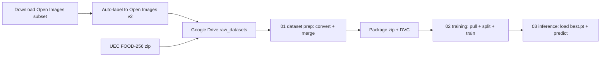

# IAA Table Assistant

Table assistant for visually impaired people, based on object detection with YOLO.

## Description

The goal of this project is to develop a system capable of identifying common objects on a table (food, cutlery, tableware) to assist visually impaired people. The system is built in incremental phases.

## Current status: Phase 1

Phase 1 focuses exclusively on:

- Dataset preparation and validation
- Training a YOLO-based object detection model
- Metric evaluation (mAP, precision, recall)
- Experiment tracking with MLflow
- Data versioning with DVC
- Model export to ONNX format

Phase 1 **does not include** real-time camera, audio synthesis, or interactive prototype.

## Model classes

| ID | Class |
|----|-------|
| 0  | food |
| 1  | cup |
| 2  | bottle |
| 3  | plate |
| 4  | spoon |
| 5  | fork |
| 6  | knife |

The class set is defined in `configs/classes.yaml` and reproduced for YOLO in `configs/data_runtime_colab.yaml`. The system does not identify the type of food; all food collapses to the single `food` class.

## Architecture

The conceptual architecture, component responsibilities and Phase 1 pipeline are documented in:

[Architecture — Phase 1](docs/architecture.md)

## Datasets

- **Open Images V7** — Source dataset for non-food classes (bottle, cup, plate, bowl, spoon, fork, knife). A subset is downloaded with FiftyOne and exported to COCO Detection format. A second iteration (`v2`) re-labels the subset through an auto-labeling pass (see below).
- **UEC FOOD-256** — Source dataset for the generic `food` class. All 256 food categories are mapped to a single `food` class.

## Workflow overview

The pipeline spans local steps and several Colab notebooks. Source-to-target
mapping lives in `configs/label_mapping.yaml`.



For environment setup and Google Drive structure, see
[Environment and Data Setup](docs/environment-and-data-setup.md).
For the auto-labeling workstream, see
[Auto-labeling Open Images](docs/auto-label-open-images.md).
For training and inference details, see
[Phase 1 — Training and Inference](docs/phase1-training-and-inference.md).

## Notebooks

| Notebook | Purpose |
|----------|---------|
| `notebooks/00_download_open_images_colab.ipynb` | Download the Open Images subset on Colab (heavy FiftyOne step). |
| `notebooks/0.5_auto_label_open_images_colab.ipynb` | Auto-label the Open Images subset into the `v2` export. |
| `notebooks/01_dataset_prep_colab.ipynb` | Convert per source to YOLO, merge to flat layout, package into a DVC-tracked zip. |
| `notebooks/02_training_colab.ipynb` | Pull the dataset package, regenerate splits, run smoke + baseline training with MLflow. |
| `notebooks/03_inference_colab.ipynb` | Load a trained `best.pt` and run predictions on specific images. |

## Project structure

```
iaa-table-assistant/
├── configs/          # Class, dataset, label-mapping, and hyperparameter configuration
├── notebooks/        # Colab notebooks (download, auto-label, prep, training, inference)
├── src/
│   ├── data/
│   │   ├── raw_setup/    # Download, extract, visualize raw datasets
│   │   ├── auto_label/   # Open Images auto-labeling (v2 generation)
│   │   ├── conversion/   # Per-source COCO/VOC → YOLO converters
│   │   ├── common/       # Shared YOLO + dataset I/O helpers
│   │   ├── preparation/  # Merge, split, package, restore, notes
│   │   └── validation/   # YOLO integrity + class distribution checks
│   ├── training/     # Model training, evaluation, MLflow (stubs + notebook orchestration)
│   ├── inference/    # ONNX export, validation, single-image prediction
│   └── utils/        # Shared utilities (paths, labels)
├── datasets/         # Images and labels (gitignored; DVC tracks the package zip)
├── models/           # Trained model weights (gitignored)
├── outputs/          # Training and inference artifacts (gitignored)
├── reports/          # Experiment logs, dataset notes, baselines, manifests
└── docs/             # Project documentation
```

## Setup

```bash
conda env create -f environment.yml
conda activate iaa-table-assistant
pip install -r requirements.txt
```

## Useful commands

Run all project scripts as modules from the project root (imports use
`from src...` absolute paths).

Download an Open Images V7 subset locally (requires FiftyOne):

```bash
python -m src.data.raw_setup.download_open_images_subset
```

Extract and inspect raw datasets in Colab (after mounting Google Drive):

```bash
python -m src.data.raw_setup.setup_colab_raw_datasets
```

Generate visual bounding box sanity checks in Colab:

```bash
python -m src.data.raw_setup.visualize_raw_bboxes
```

Convert, merge, and package the final dataset (see notebook 01 for the full flow):

```bash
python -m src.data.conversion.convert_open_images_to_yolo
python -m src.data.conversion.convert_uec_food_to_yolo
python -m src.data.preparation.prepare_dataset
python -m src.data.preparation.update_dataset_notes
```

## License

MIT
