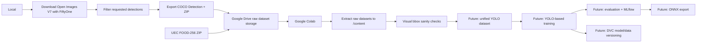

# Architecture — Phase 1

## Overview

This project is a visual table assistant for people with visual impairment.

Phase 1 focuses on data acquisition, raw dataset inspection, future YOLO dataset
preparation, model training, evaluation, and export.

Real-time camera capture and audio synthesis belong to Phase 2.

## Current Phase 1 Architecture

## Raw Dataset Sources

### Open Images V7

Used for table-related object classes (bottle, cup, plate, bowl, cutlery).

- Downloaded locally with FiftyOne.
- Detection annotations (bounding boxes) are used.
- Requested detections are filtered to remove unrelated classes.
- Exported to portable COCO Detection format.
- Stored as ZIP in Google Drive.

Current source classes:

- Bottle
- Bowl
- Coffee cup
- Fork
- Kitchen knife
- Knife
- Mixing bowl
- Plate
- Spoon
- Wine glass

### UEC FOOD-256

Used for generic food detection.

- All 256 food categories will be mapped to the final class `food`.
- `category.txt` maps numeric food IDs to food names.
- Each category folder contains images and a `bb_info.txt` file.
- `bb_info.txt` format: `img x1 y1 x2 y2`
- Coordinates are absolute pixel values.
- Some images may contain multiple bounding boxes.

## Detection Classes

| ID | Class       | Description                    |
|----|-------------|--------------------------------|
| 0  | food        | Generic food item on the table |
| 1  | cup   | Cups and glasses               |
| 2  | bottle      | Bottles                        |
| 3  | plate  | Plates and bowls               |
| 4  | spoon       | Spoons                         |
| 5  | fork        | Forks                          |
| 6  | knife       | Knives                         |

The system does not aim to identify the specific type of food. Food is treated as
a generic detection class.

## Source-to-Target Label Mapping

| Source Dataset   | Source Label  | Target Class |
|------------------|---------------|--------------|
| Open Images V7   | Bottle        | bottle       |
| Open Images V7   | Coffee cup    | cup    |
| Open Images V7   | Wine glass    | cup    |
| Open Images V7   | Bowl          | plate   |
| Open Images V7   | Plate         | plate   |
| Open Images V7   | Mixing bowl   | plate   |
| Open Images V7   | Spoon         | spoon        |
| Open Images V7   | Fork          | fork         |
| Open Images V7   | Knife         | knife        |
| Open Images V7   | Kitchen knife | knife        |
| UEC FOOD-256     | any category  | food         |

This mapping will be applied later during unified YOLO dataset preparation.

## Components

### Data Acquisition and Raw Setup (`src/data/`)

Current scripts:

- **`download_open_images_subset.py`** — Runs locally. Downloads selected Open Images
  V7 classes with FiftyOne, validates class names, filters detections, exports to
  COCO Detection format, and creates a ZIP for Google Drive.
- **`setup_colab_raw_datasets.py`** — Runs in Colab after mounting Google Drive.
  Finds and extracts raw dataset ZIPs into `/content`, inspects Open Images COCO
  JSON and UEC FOOD-256 structure.
- **`visualize_raw_bboxes.py`** — Runs in Colab. Generates visual sanity check
  images for raw bounding boxes from both datasets.

### Dataset Preparation (`src/data/`) — Planned

- Convert Open Images COCO annotations to YOLO format.
- Convert UEC FOOD-256 `bb_info.txt` annotations to YOLO format.
- Apply source-to-target label mapping.
- Create a unified dataset combining both sources.
- Split into train/validation/test.
- Validate dataset integrity.

### Training (`src/training/`) — Planned

- YOLO-based detector training.
- Evaluation with mAP50, mAP50-95, precision, recall.
- Experiment tracking with MLflow.

Training scripts exist as stubs. They will be implemented after dataset preparation
is complete.

### Export (`src/inference/`) — Planned

- Export trained model to ONNX format.
- Validate exported ONNX model.

### Utilities (`src/utils/`)

- Project-relative path resolution.
- YOLO label reading and class counting.

## Configuration

- `configs/data.yaml` — Dataset paths and class definitions (YOLO format).
- `configs/classes.yaml` — Class metadata (names, colors).
- `configs/train_baseline.yaml` — Training hyperparameters (placeholder until
  dataset preparation is complete).
- Future: `configs/label_mapping.yaml` — Source-to-target label mapping.

## Model Strategy

YOLO (Ultralytics) is selected as the detection framework because it balances
detection performance and inference speed, which is important for a future
real-time assistant.

- Exact model version and hyperparameters will be defined after dataset preparation.
- Future export target is ONNX for deployment.

## Out of Scope (Phase 2+)

- Real-time webcam capture
- Voice / audio synthesis
- User interface
- Interactive prototype
- User testing
