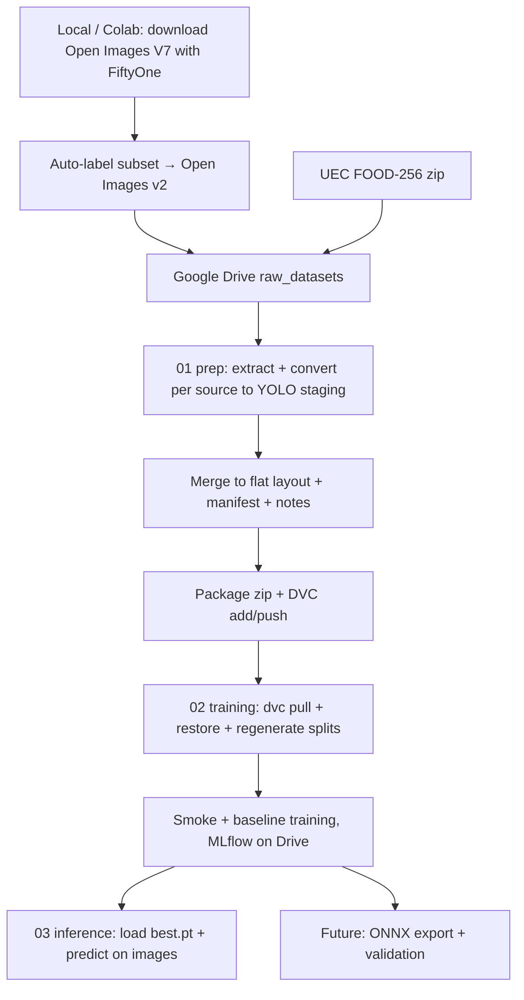

# Architecture — Phase 1

## Overview

This project is a visual table assistant for people with visual impairment.

Phase 1 covers data acquisition, raw dataset inspection, YOLO dataset
preparation, packaging and versioning, model training, evaluation, and export.

Real-time camera capture and audio synthesis belong to Phase 2.

## Current Phase 1 Architecture

The split into train/val/test is not materialized as folders. It is produced
at training time as path-list text files (`reports/dataset_splits/*.txt`)
consumed by YOLO through `configs/data_runtime_colab.yaml`.

## Raw Dataset Sources

### Open Images V7

Used for table-related object classes (bottle, cup, plate, bowl, cutlery).

- A subset is downloaded with FiftyOne (locally or on Colab via
  `notebooks/00_download_open_images_colab.ipynb`).
- Detection annotations (bounding boxes) are used.
- Requested detections are filtered to remove unrelated classes.
- Exported to portable COCO Detection format and stored as a ZIP in Drive.
- A second iteration (`open_images_subset_v2`) re-labels the subset through an
  auto-labeling pass (`src/data/auto_label/`,
  `notebooks/0.5_auto_label_open_images_colab.ipynb`). The full v2 labels are
  stored as `labels_v2_full.json` on Drive and override the in-zip labels
  during raw setup. See `docs/auto-label-open-images.md`.

Current source classes:

- Bottle
- Bowl
- Coffee cup
- Fork
- Kitchen knife
- Knife
- Mixing bowl
- Plate
- Spoon
- Wine glass

### UEC FOOD-256

Used for generic food detection.

- All 256 food categories will be mapped to the final class `food`.
- `category.txt` maps numeric food IDs to food names.
- Each category folder contains images and a `bb_info.txt` file.
- `bb_info.txt` format: `img x1 y1 x2 y2`
- Coordinates are absolute pixel values.
- Some images may contain multiple bounding boxes.

## Detection Classes

| ID | Class       | Description                    |
|----|-------------|--------------------------------|
| 0  | food        | Generic food item on the table |
| 1  | cup   | Cups and glasses               |
| 2  | bottle      | Bottles                        |
| 3  | plate  | Plates and bowls               |
| 4  | spoon       | Spoons                         |
| 5  | fork        | Forks                          |
| 6  | knife       | Knives                         |

The system does not aim to identify the specific type of food. Food is treated as
a generic detection class.

## Source-to-Target Label Mapping

| Source Dataset   | Source Label  | Target Class |
|------------------|---------------|--------------|
| Open Images V7   | Bottle        | bottle       |
| Open Images V7   | Coffee cup    | cup    |
| Open Images V7   | Wine glass    | cup    |
| Open Images V7   | Bowl          | plate   |
| Open Images V7   | Plate         | plate   |
| Open Images V7   | Mixing bowl   | plate   |
| Open Images V7   | Spoon         | spoon        |
| Open Images V7   | Fork          | fork         |
| Open Images V7   | Knife         | knife        |
| Open Images V7   | Kitchen knife | knife        |
| UEC FOOD-256     | any category  | food         |

This mapping is materialized in `configs/label_mapping.yaml` (the
machine-readable source of truth) and applied during per-source YOLO
conversion.

## Components

### Data Acquisition and Raw Setup (`src/data/raw_setup/`)

- **`download_open_images_subset.py`** — Downloads selected Open Images V7
  classes with FiftyOne, validates class names, filters detections, exports to
  COCO Detection format, and creates a ZIP for Google Drive.
- **`setup_colab_raw_datasets.py`** — Runs in Colab after mounting Google
  Drive. Finds and extracts raw dataset ZIPs into `datasets/raw_datasets/`,
  applies the `labels_v2_full.json` override for Open Images v2, and inspects
  the Open Images COCO JSON and UEC FOOD-256 structure.
- **`visualize_raw_bboxes.py`** — Generates visual sanity-check images for raw
  bounding boxes from both datasets.

### Open Images Auto-labeling (`src/data/auto_label/`)

Generates the Open Images `v2` export by running a detection model over the
downloaded subset and mapping detections to the target taxonomy. Covered in
`docs/auto-label-open-images.md`.

### Dataset Conversion and Preparation (`src/data/conversion/`, `preparation/`)

- **`conversion/convert_open_images_to_yolo.py`** — COCO → YOLO, applies
  `label_mapping.yaml`, writes per-image multi-class labels to staging.
- **`conversion/convert_uec_food_to_yolo.py`** — UEC `bb_info.txt` (VOC-style)
  → YOLO, all boxes mapped to `food`.
- **`preparation/prepare_dataset.py`** — Merges both staging dirs into the flat
  layout `datasets/table_assistant_yolo/{images,labels}/`, renames files to
  `<seq>_<classes>.jpg`, writes `reports/dataset_manifest.csv`, deletes staging.
- **`preparation/update_dataset_notes.py`** — Refreshes the auto-managed
  distribution section in `reports/dataset_notes.md`.
- **`preparation/split_dataset.py`** — Stratified 60/15/25 split (rarest class
  per image, seed 42); writes path-list text files under
  `reports/dataset_splits/`. Run at training time.
- **`preparation/restore_dataset_package.py`** — Unzips the DVC package and
  exposes it at the canonical dataset path via symlink. Run at training time.

### Validation (`src/data/validation/`)

- **`validate_dataset.py`** — YOLO label integrity (5 fields, class id range,
  bbox bounds).
- **`analyze_class_distribution.py`** — Cross-source per-class counts and bbox
  size stats; writes `reports/class_distribution_<timestamp>.json`.
- **`visualize_yolo_mapping.py`** — Renders per-class samples with converted
  YOLO boxes for visual verification.

### Training (`src/training/`)

The live training flow lives in `notebooks/02_training_colab.ipynb`: smoke and
baseline YOLO runs with MLflow tracking persisted to Google Drive, plus per-run
JSON summaries under `reports/baselines/`. The `src/training/` modules
(`train.py`, `evaluate.py`, `log_mlflow.py`) remain stubs to be filled as the
notebook logic stabilizes. See `docs/phase1-training-and-inference.md`.

### Inference and Export (`src/inference/`)

- **`predict_image.py`** — single-image prediction helper (stub; the live flow
  is in `notebooks/03_inference_colab.ipynb`).
- **`export_onnx.py`, `validate_onnx.py`** — ONNX export and validation (stubs,
  planned).

### Utilities (`src/utils/`)

- Project-relative path resolution (`paths.py`).
- YOLO label reading and class counting (`labels.py`).

## Configuration

- `configs/data_runtime_colab.yaml` — Dataset paths and class definitions (YOLO format).
- `configs/classes.yaml` — Class metadata (names, colors).
- `configs/label_mapping.yaml` — Source-to-target label mapping (machine-readable).
- `configs/train_baseline.yaml` — Training hyperparameters (placeholder).

## Data Versioning (DVC)

The final dataset is packaged as a single artifact
`datasets/table_assistant_yolo_package.zip` (dataset + metadata) and tracked
with DVC. Only `…package.zip.dvc` is committed to git; the zip itself lives on
the `gdrive_storage` Google Drive remote. At training time the package is
pulled, unzipped, and exposed at `datasets/table_assistant_yolo/` via symlink,
then the split files are regenerated for the current runtime.

## Model Strategy

YOLO (Ultralytics) is selected as the detection framework because it balances
detection performance and inference speed, which is important for a future
real-time assistant.

- Exact model version and hyperparameters will be defined after dataset preparation.
- Future export target is ONNX for deployment.

## Out of Scope (Phase 2+)

- Real-time webcam capture
- Voice / audio synthesis
- User interface
- Interactive prototype
- User testing
