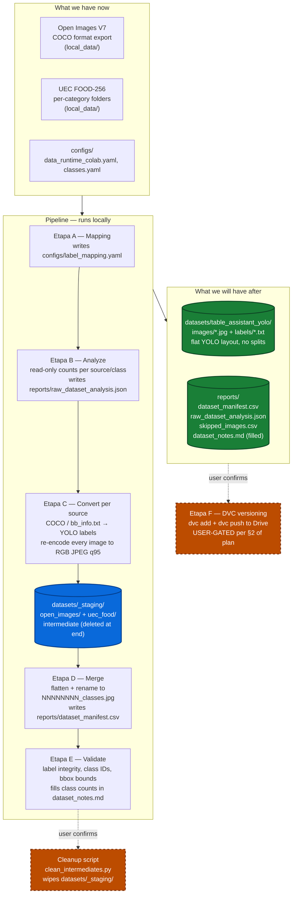

# Phase 1 — Dataset Preparation Flow

Visual companion to [`phase1-dataset-preparation-plan.md`](./phase1-dataset-preparation-plan.md).
High-level data flow from raw inputs to the prepared YOLO dataset. For
decisions, gotchas, and per-stage implementation detail, see the plan.

## Diagram

## Reading the diagram

- **What we have now** — the two raw datasets already on disk plus the
  existing target-class configs. `configs/label_mapping.yaml` is the one
  config that doesn't exist yet; Etapa A creates it.
- **Pipeline** — five etapas running sequentially on the local machine.
  The intermediate `datasets/_staging/` (blue cylinder) exists only
  between Etapa C and Etapa D and is deleted by the cleanup script at
  the end.
- **What we will have after** — the flat YOLO dataset (`images/` +
  `labels/`, no split subdirs) plus four files in `reports/` covering
  provenance, analysis, errors, and class counts (green cylinders).
- **Dashed orange nodes** — intentionally outside the main flow.
  Etapa F (DVC) and the cleanup script both require explicit user
  confirmation in the same conversation turn per §2 of the plan.

## Etapas at a glance

| Etapa | Action                 | Key output                                   |
| ----- | ---------------------- | -------------------------------------------- |
| A     | Materialize mapping    | `configs/label_mapping.yaml`                 |
| B     | Analyze raw datasets   | `reports/raw_dataset_analysis.json`          |
| C     | Convert per source     | `datasets/_staging/{open_images,uec_food}/`  |
| D     | Merge + rename         | flat layout + `reports/dataset_manifest.csv` |
| E     | Validate               | filled class counts in `dataset_notes.md`    |
| F     | DVC versioning (gated) | `.dvc` file + remote push                    |

## Notes

- The pipeline runs end-to-end on the local machine. No Colab step is
  involved in dataset preparation; Colab enters the picture later, at
  training time.
- Re-running any etapa is safe: each stage wipes its own output before
  writing, so no stale state accumulates.
- Open Images is processed before UEC throughout, so the manifest is
  human-scannable by source.
